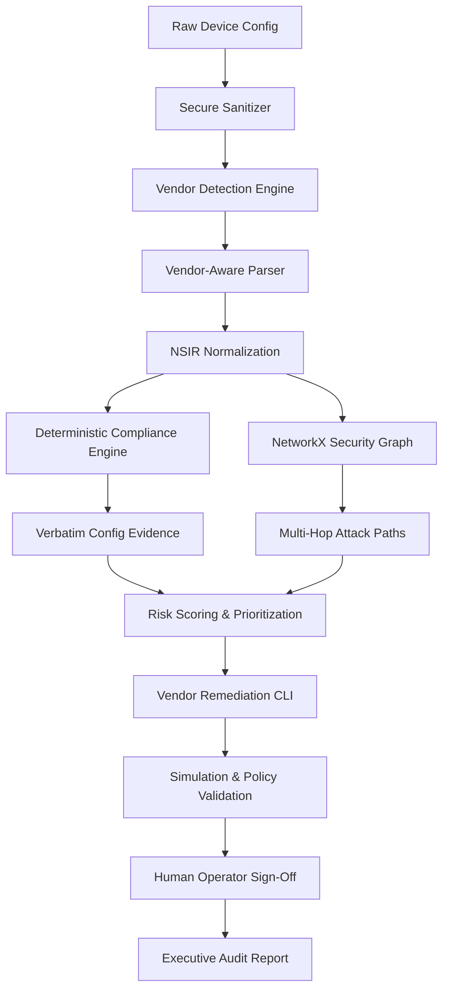

# NETRA — AI-Driven Multi-Vendor Network Security Compliance Auditor

**Smart India Hackathon 2026 (SIH 2026)**  
**Problem Statement ID:** `SIH26155`  
**Organization:** National Technical Research Organisation (NTRO)

---

## 🛡️ Executive Summary

Modern enterprise and sovereign critical infrastructure networks consist of heterogeneous appliances from multiple vendors (Cisco, Juniper, Fortinet, Palo Alto, Arista, and open-source NOS like SONiC). Auditing configurations across diverse CLI syntaxes and XML/JSON data models creates severe blind spots, delayed threat detection, and dangerous configuration drift.

**NETRA** addresses this national security challenge by ingesting multi-vendor configurations, normalizing them into a sovereign **Network Security Intermediate Representation (NSIR)**, performing rigorous rule-based compliance audits (CIS, NIST SP 800-53, DISA STIG, ISO 27001), evaluating reachability via a **NetworkX Security Graph**, and synthesizing safe, vendor-native remediation playbooks with dry-run simulation and manual approval gates.

---

## ⚡ Key Capabilities & Architecture



### 1. Multi-Vendor Fabric Support
- **Cisco IOS & IOS-XE:** Insecure VTY transports, SSHv2 enforcement, SNMPv1/v2 community exposure, IP source routing, Type-7 password encoding.
- **Juniper JunOS:** Telnet service elimination, unauthenticated SNMP community strings, syslog verification.
- **Fortinet FortiOS:** HTTP admin interface elimination, password complexity policies, zone isolation.
- **Palo Alto PAN-OS:** Zone Protection Profiles, log forwarding to SIEM.
- **Arista EOS:** eAPI HTTP encryption enforcement, centralized AAA.
- **SONiC (Software for Open Networking in the Cloud):** Telemetry & service baseline verification.

### 2. Network Security Intermediate Representation (NSIR)
Translates proprietary vendor syntax into canonical object graphs:
- Uniform interfaces and subnet mappings
- Standardized Access Control Lists (ACLs)
- Centralized AAA & Encryption models
- Management protocol surface enumeration (SSH, Telnet, HTTP, SNMP)

### 3. Attack Path & Graph Reachability Analysis
Utilizes **NetworkX** to compute multi-hop lateral movement vectors from untrusted external perimeters to sensitive crown jewels (Database Servers, Management Planes).

### 4. Zero-Disruption Remediation Workflow
Strict change control:
`Finding → Fix Preview → Dry-Run Simulation → Security Policy Validation → Human Approval`.
**No configurations are ever automatically applied to production devices without operator verification.**

### 5. AI Threat Reasoning (Optional Gemini 1.5)
- Explains findings and attacker exploitation narratives in plain English.
- Evaluates proprietary or unfamiliar vendor directives.
- Works 100% offline with high-fidelity deterministic fallbacks if no API key is supplied.

---

## 💻 Tech Stack

| Layer | Technologies |
|---|---|
| **Frontend** | React 18, Vite, Tailwind CSS, Lucide Icons |
| **Backend** | Python 3.11+, FastAPI, NetworkX, Motor (Async MongoDB), Pydantic v2 |
| **Database** | MongoDB (Community or Atlas) |
| **AI Engine** | Google Gemini 1.5 Flash (Optional via `GEMINI_API_KEY`) |

---

## 🚀 Quick Start Guide (Windows)

### Prerequisites
1. **Python 3.11+** installed (`python --version`)
2. **Node.js v18+ & npm** installed (`node -v`)
3. **MongoDB** running locally on port 27017 or a MongoDB Atlas URI

---

### Step 1: Environment Configuration

Copy `.env.example` to `backend/.env`:
```powershell
cp .env.example backend/.env
```

Ensure `backend/.env` has:
```env
MONGODB_URI=mongodb://localhost:27017
DATABASE_NAME=netra
APP_ENV=development
DEBUG=true

# Optional: Add Gemini API Key for AI explanations (leave empty for deterministic engine)
GEMINI_API_KEY=
AI_ENABLED=false
```

---

### Step 2: Backend Setup

Open a PowerShell terminal:
```powershell
cd c:\Users\PIYUSH\OneDrive\Desktop\SIH\backend

# 1. Create and activate virtual environment (optional but recommended)
python -m venv venv
.\venv\Scripts\Activate.ps1

# 2. Install dependencies
pip install -r requirements.txt

# 3. Start the FastAPI server
python -m uvicorn main:app --reload --host 127.0.0.1 --port 8000
```
> **Note:** On first startup, the backend automatically connects to MongoDB and seeds realistic multi-vendor devices, configurations, findings, remediation plans, and attack paths!

Verify backend at: `http://localhost:8000/api/health`  
Interactive Swagger docs: `http://localhost:8000/api/docs`

---

### Step 3: Frontend Setup

Open a second PowerShell terminal:
```powershell
cd c:\Users\PIYUSH\OneDrive\Desktop\SIH\frontend

# 1. Install frontend packages
npm install

# 2. Launch Vite dev server
npm run dev
```

Open your browser at: **`http://localhost:5173`**

---

## 📋 Comprehensive Page Tour

| # | Page | Key Functionality |
|---|---|---|
| **1** | **Dashboard** | Real-time security posture, compliance percentage, severity breakdown, top risky assets, recent violations. |
| **2** | **Configuration Audit** | Upload or paste configs; preset samples (Cisco, Juniper, FortiGate, Palo Alto, Arista, SONiC); 1-click end-to-end audit pipeline. |
| **3** | **Compliance Explorer** | Catalog of CIS, NIST, STIG, and ISO27001 network rules with technical rationales and search filters. |
| **4** | **Findings & Evidence** | Verbatim configuration line extraction, severity indicators, status updates, and AI threat modeling. |
| **5** | **Security Graph** | NetworkX topology visualization with highlighted multi-hop attack paths from Internet to internal crown jewels. |
| **6** | **Risk Analysis** | Criticality vs. Exposure matrix, asset prioritization queue, and composite risk scoring. |
| **7** | **Remediation Simulator** | Safe change control: Before/After diffs, dry-run simulation output, policy verification, and human operator sign-off. |
| **8** | **Configuration Drift** | Diff comparison between baseline and candidate configs; detects security regressions and unauthorized lines. |
| **9** | **Audit Reports** | Formal executive and technical compliance dossiers with CISO recommendations; print/PDF ready. |

---

## 📁 Repository Directory Structure

```text
SIH/
├── .env.example                     # Root environment template
├── README.md                        # Project documentation & SIH demo guide
├── backend/
│   ├── .env                         # Backend environment variables
│   ├── requirements.txt             # Python dependencies
│   ├── main.py                      # FastAPI application entry point
│   ├── sample_configs/              # Preloaded sample configs for 6 vendors
│   │   ├── cisco_ios_sample.cfg
│   │   ├── juniper_junos_sample.cfg
│   │   ├── fortinet_fortios_sample.cfg
│   │   ├── palo_alto_sample.xml
│   │   ├── arista_eos_sample.cfg
│   │   └── sonic_sample.json
│   └── app/
│       ├── core/                    # Config, MongoDB manager, Data seeder
│       ├── models/                  # Pydantic schemas (NSIR, Findings, Audits)
│       ├── services/                # Parser, Compliance, Graph, Remediation, AI
│       └── api/routes/              # REST API route controllers
└── frontend/
    ├── package.json                 # React + Tailwind dependencies
    ├── vite.config.js               # Vite bundler & API reverse proxy
    ├── tailwind.config.js           # Cyber SOC color palette
    ├── index.html                   # HTML entry point
    └── src/
        ├── api/client.js            # Unified API communication client
        ├── components/              # Reusable badges, meters, gauges, modals
        └── pages/                   # All 9 SOC dashboard pages
```

---

## 🏆 SIH 2026 Evaluation Checklist

- [x] Multi-vendor configuration ingestion (Cisco, Juniper, Fortinet, Palo Alto, Arista, SONiC)
- [x] NSIR normalization
- [x] Rule-based deterministic compliance engine (CIS, NIST, STIG, ISO 27001)
- [x] Verbatim configuration evidence extraction
- [x] NetworkX-powered Security Graph & attack reachability paths
- [x] Risk calculation using criticality + exposure + reachability
- [x] Staged remediation workflow with Before/After diffs & dry-run simulation
- [x] Configuration drift detection with golden baseline scoring
- [x] Executive audit reporting
- [x] Zero placeholder buttons; fully functional, demo-ready implementation
