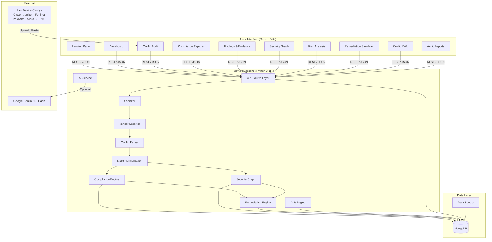
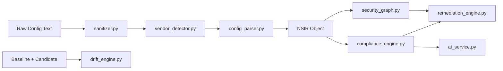
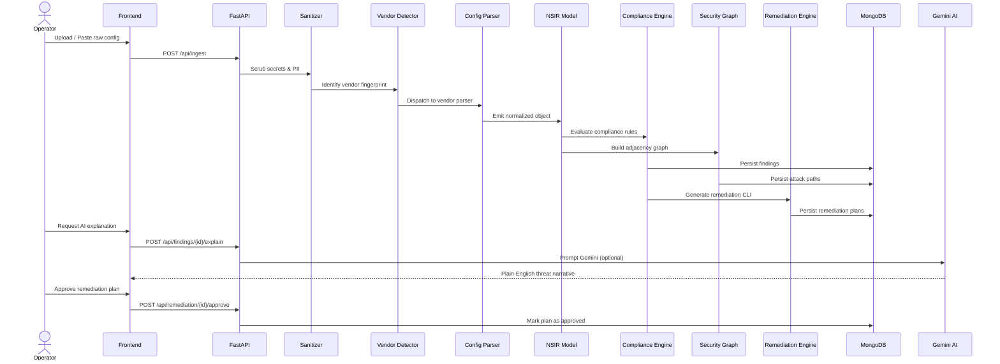
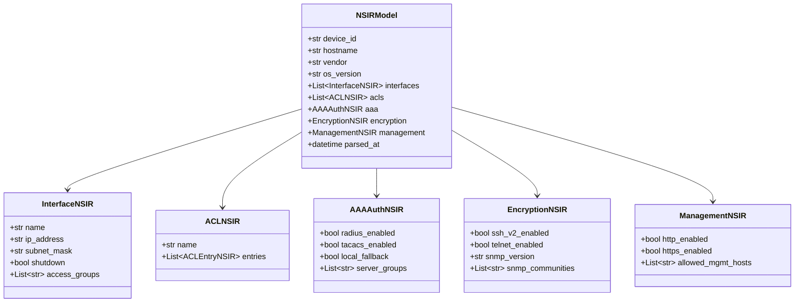
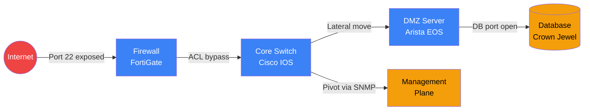
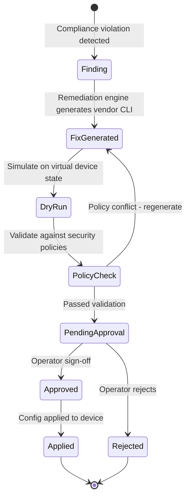
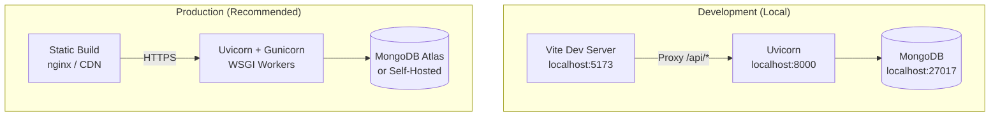

# NETRA — System Architecture

**AI-Driven Multi-Vendor Network Security Compliance Auditor**  
**Smart India Hackathon 2026 | Problem Statement ID: SIH26155**  
**Organization: National Technical Research Organisation (NTRO)**

---

## Table of Contents

1. [System Overview](#1-system-overview)
2. [High-Level Architecture](#2-high-level-architecture)
3. [Technology Stack](#3-technology-stack)
4. [Repository Structure](#4-repository-structure)
5. [Backend Architecture](#5-backend-architecture)
   - [Entry Point](#51-entry-point)
   - [Core Layer](#52-core-layer)
   - [Data Models Layer](#53-data-models-layer)
   - [Services Layer](#54-services-layer)
   - [API Routes Layer](#55-api-routes-layer)
6. [Frontend Architecture](#6-frontend-architecture)
   - [Pages](#61-pages)
   - [Components](#62-components)
   - [API Client](#63-api-client)
7. [Data Flow Pipeline](#7-data-flow-pipeline)
8. [Network Security Intermediate Representation (NSIR)](#8-network-security-intermediate-representation-nsir)
9. [Compliance Engine](#9-compliance-engine)
10. [Security Graph & Attack Path Analysis](#10-security-graph--attack-path-analysis)
11. [Remediation Workflow](#11-remediation-workflow)
12. [AI Integration](#12-ai-integration)
13. [Database Schema](#13-database-schema)
14. [API Reference Summary](#14-api-reference-summary)
15. [Security Considerations](#15-security-considerations)
16. [Deployment Architecture](#16-deployment-architecture)

---

## 1. System Overview

NETRA is a full-stack cybersecurity auditing platform designed to solve the challenge of heterogeneous, multi-vendor network infrastructure compliance. Enterprise and sovereign critical infrastructure networks typically consist of appliances from multiple vendors, each with proprietary CLI syntax and configuration data models. Manually auditing these creates dangerous blind spots, delays threat detection, and leads to configuration drift.

NETRA solves this by:
- **Ingesting** raw device configurations from 6+ vendors.
- **Normalizing** them into a vendor-agnostic **Network Security Intermediate Representation (NSIR)**.
- **Auditing** against industry standards (CIS, NIST SP 800-53, DISA STIG, ISO 27001).
- **Visualizing** lateral movement attack paths using graph analysis.
- **Generating** safe, vendor-native remediation playbooks with human-in-the-loop approval.

---

## 2. High-Level Architecture



---

## 3. Technology Stack

| Layer | Technology | Purpose |
|---|---|---|
| **Frontend Framework** | React 18 | Component-based UI |
| **Frontend Build Tool** | Vite | Fast HMR dev server & bundler |
| **Frontend Styling** | Tailwind CSS | Utility-first cyber SOC theme |
| **Frontend Icons** | Lucide React | Consistent icon system |
| **Backend Framework** | FastAPI (Python 3.11+) | Async REST API |
| **Backend ORM** | Motor (Async MongoDB Driver) | Non-blocking DB access |
| **Data Validation** | Pydantic v2 | Schema enforcement |
| **Graph Analysis** | NetworkX | Attack path computation |
| **Database** | MongoDB | Document store for configs & findings |
| **AI Layer** | Google Gemini 1.5 Flash | Optional threat narration & explanation |

---

## 4. Repository Structure

```text
SIH/
├── .env.example                      # Root environment template
├── .gitignore
├── README.md
├── docs/
│   └── architecture.md               # ← This document
└── src/
    ├── backend/
    │   ├── main.py                   # FastAPI application entry point
    │   ├── requirements.txt          # Python dependencies
    │   ├── runtime.txt               # Python version pin
    │   ├── .env                      # Backend environment variables
    │   ├── sample_configs/           # Preloaded vendor config samples
    │   │   ├── cisco_ios_sample.cfg
    │   │   ├── juniper_junos_sample.cfg
    │   │   ├── fortinet_fortios_sample.cfg
    │   │   ├── palo_alto_sample.xml
    │   │   ├── arista_eos_sample.cfg
    │   │   └── sonic_sample.json
    │   └── app/
    │       ├── __init__.py
    │       ├── core/
    │       │   ├── config.py         # App settings via Pydantic BaseSettings
    │       │   ├── database.py       # Motor async MongoDB manager
    │       │   └── seeder.py         # Demo data seeder (auto-runs on startup)
    │       ├── models/
    │       │   └── models.py         # All Pydantic v2 schemas (NSIR, Findings, etc.)
    │       ├── services/
    │       │   ├── sanitizer.py      # PII & secret scrubber
    │       │   ├── vendor_detector.py# Heuristic vendor identification
    │       │   ├── config_parser.py  # Vendor-aware multi-format parser
    │       │   ├── compliance_engine.py # Rule-based deterministic auditor
    │       │   ├── security_graph.py # NetworkX topology & attack paths
    │       │   ├── remediation_engine.py # CLI fix generation & simulation
    │       │   ├── drift_engine.py   # Baseline vs. candidate diff
    │       │   └── ai_service.py     # Gemini integration (optional)
    │       └── api/
    │           └── routes/
    │               ├── health.py     # GET /api/health
    │               ├── ingestion.py  # POST /api/ingest
    │               ├── devices.py    # GET /api/devices
    │               ├── audit.py      # POST /api/audit
    │               ├── findings.py   # GET/PATCH /api/findings
    │               ├── compliance.py # GET /api/compliance/rules
    │               ├── graph.py      # GET /api/graph
    │               ├── remediation.py# GET/POST /api/remediation
    │               ├── drift.py      # POST /api/drift/compare
    │               ├── reports.py    # GET /api/reports
    │               └── dashboard.py  # GET /api/dashboard/stats
    └── frontend/
        ├── index.html
        ├── package.json
        ├── vite.config.js            # Vite config + API proxy to :8000
        ├── tailwind.config.js        # Custom cyber SOC color palette
        └── src/
            ├── main.jsx              # React DOM mount point
            ├── App.jsx               # Router setup (React Router v6)
            ├── index.css             # Global styles & Tailwind directives
            ├── api/
            │   └── client.js         # Centralized Axios/fetch API client
            ├── components/
            │   ├── Navbar.jsx
            │   ├── Sidebar.jsx
            │   ├── AIModal.jsx
            │   ├── ComplianceRing.jsx
            │   ├── MetricsCard.jsx
            │   ├── RiskMeter.jsx
            │   └── SeverityBadge.jsx
            └── pages/
                ├── LandingPage.jsx
                ├── Dashboard.jsx
                ├── ConfigAudit.jsx
                ├── ComplianceExplorer.jsx
                ├── Findings.jsx
                ├── SecurityGraph.jsx
                ├── RiskAnalysis.jsx
                ├── RemediationSimulator.jsx
                ├── ConfigDrift.jsx
                └── AuditReports.jsx
```

---

## 5. Backend Architecture

### 5.1 Entry Point

**`main.py`** is the FastAPI application root. On startup it:
1. Reads settings from `app/core/config.py`.
2. Establishes a Motor async connection to MongoDB via `app/core/database.py`.
3. Runs `app/core/seeder.py` to seed realistic multi-vendor demo data if the DB is empty.
4. Registers all 11 API route modules under the `/api` prefix.
5. Exposes interactive Swagger docs at `/api/docs`.

### 5.2 Core Layer

| Module | Responsibility |
|---|---|
| `config.py` | Reads `MONGODB_URI`, `DATABASE_NAME`, `GEMINI_API_KEY`, `AI_ENABLED`, `DEBUG` from `.env` via Pydantic `BaseSettings`. |
| `database.py` | Singleton Motor `AsyncIOMotorClient`; provides typed collection accessors for all MongoDB collections. |
| `seeder.py` | Idempotent demo data seeder — creates devices, configurations, findings, audit records, and attack-path graphs on first boot. |

### 5.3 Data Models Layer

**`models/models.py`** defines all Pydantic v2 schemas:

| Schema | Description |
|---|---|
| `NSIRModel` | Normalized device config (interfaces, ACLs, AAA, encryption, management protocols) |
| `FindingModel` | Compliance violation record with severity, evidence, rule reference, and status |
| `AuditRecordModel` | Full audit run metadata including findings list and risk score |
| `RemediationPlanModel` | Before/After CLI diff, dry-run output, policy validation status, approval state |
| `AttackPathModel` | Source-to-target graph path with hop sequence and risk weight |
| `DriftResultModel` | Diff between baseline and candidate config |
| `ComplianceRuleModel` | Canonical rule definition (rule ID, framework, description, severity, rationale) |
| `DeviceModel` | Network device metadata (hostname, vendor, OS version, IP, criticality) |

### 5.4 Services Layer

This is the intelligence core of NETRA. Services are pure Python modules called from route handlers.



| Service | Key Responsibility |
|---|---|
| `sanitizer.py` | Scrubs secrets, API keys, plaintext passwords from raw configs before any processing. |
| `vendor_detector.py` | Heuristic fingerprinting — identifies Cisco IOS, JunOS, FortiOS, PAN-OS, EOS, or SONiC from config syntax patterns. |
| `config_parser.py` | Dispatches to vendor-specific sub-parsers (IOS text, XML for PAN-OS, JSON for SONiC) and emits a normalized `NSIRModel`. |
| `compliance_engine.py` | Evaluates the NSIR against 50+ deterministic rules mapped to CIS, NIST SP 800-53, DISA STIG, and ISO 27001. Extracts verbatim config lines as evidence. |
| `security_graph.py` | Builds a directed `NetworkX` graph of device adjacency; computes multi-hop attack paths from external perimeter to internal crown jewels. |
| `remediation_engine.py` | Generates vendor-native CLI remediation commands for each finding; simulates dry-run output; validates against security policies. |
| `drift_engine.py` | Diffs a candidate config against a golden baseline; identifies added/removed lines and assigns a drift risk score. |
| `ai_service.py` | Wraps Google Gemini 1.5 Flash; generates plain-English threat narratives and attacker exploitation stories. Falls back gracefully when `AI_ENABLED=false`. |

### 5.5 API Routes Layer

All routes are mounted under `/api`. Each file is a self-contained `APIRouter`.

| Route File | Endpoints | Description |
|---|---|---|
| `health.py` | `GET /health` | Liveness & MongoDB connectivity check |
| `ingestion.py` | `POST /ingest` | Accept raw config text/file; trigger sanitize → detect → parse → NSIR pipeline |
| `devices.py` | `GET /devices` | List all tracked network devices |
| `audit.py` | `POST /audit` | Run compliance audit on a stored/submitted config |
| `findings.py` | `GET /findings`, `PATCH /findings/{id}` | Retrieve findings; update status (open/resolved/suppressed) |
| `compliance.py` | `GET /compliance/rules` | Paginated catalog of all compliance rules with filters |
| `graph.py` | `GET /graph` | Return security graph nodes/edges and attack paths |
| `remediation.py` | `GET /remediation`, `POST /remediation/{id}/approve` | Fetch remediation plans; human operator approval gate |
| `drift.py` | `POST /drift/compare` | Submit baseline + candidate configs for diff analysis |
| `reports.py` | `GET /reports` | Generate executive & technical audit report documents |
| `dashboard.py` | `GET /dashboard/stats` | Aggregate metrics: compliance %, severity distribution, top risky assets |

---

## 6. Frontend Architecture

The frontend is a React 18 Single Page Application (SPA) built with Vite. Navigation is handled by **React Router v6**. API calls are proxied through Vite's `devServer.proxy` to the FastAPI backend at `http://localhost:8000`.

### 6.1 Pages

| Page | Route | Description |
|---|---|---|
| `LandingPage.jsx` | `/` | Marketing & entry point |
| `Dashboard.jsx` | `/dashboard` | Real-time security posture, severity charts, top risky assets |
| `ConfigAudit.jsx` | `/audit` | Upload/paste config, vendor presets, 1-click pipeline trigger |
| `ComplianceExplorer.jsx` | `/compliance` | Searchable CIS/NIST/STIG/ISO 27001 rule catalog |
| `Findings.jsx` | `/findings` | Verbatim evidence viewer, severity filters, AI threat modal |
| `SecurityGraph.jsx` | `/graph` | NetworkX topology with attack path overlay |
| `RiskAnalysis.jsx` | `/risk` | Criticality vs. exposure matrix, asset prioritization queue |
| `RemediationSimulator.jsx` | `/remediation` | Before/After CLI diff, dry-run output, approval sign-off |
| `ConfigDrift.jsx` | `/drift` | Side-by-side baseline vs. candidate diff with regression alerts |
| `AuditReports.jsx` | `/reports` | Print/PDF-ready executive & technical dossiers |

### 6.2 Components

| Component | Purpose |
|---|---|
| `Navbar.jsx` | Top navigation bar with branding and global actions |
| `Sidebar.jsx` | Collapsible left nav linking all 9 SOC pages |
| `AIModal.jsx` | Modal overlay for Gemini AI threat narrative display |
| `ComplianceRing.jsx` | SVG donut ring showing compliance % |
| `MetricsCard.jsx` | Reusable KPI card with title, value, and trend indicator |
| `RiskMeter.jsx` | Animated arc gauge for composite risk score |
| `SeverityBadge.jsx` | Color-coded pill badge (Critical / High / Medium / Low / Info) |

### 6.3 API Client

**`api/client.js`** is the single point of contact for all backend communication. It:
- Wraps all fetch calls with consistent base URL resolution.
- Handles JSON serialization / deserialization.
- Provides per-feature helper functions used across pages.

---

## 7. Data Flow Pipeline

The core audit pipeline follows a strict sequential flow:



---

## 8. Network Security Intermediate Representation (NSIR)

NSIR is the canonical, vendor-agnostic representation of a device's security-relevant configuration. It enables the compliance engine and graph builder to operate without any vendor-specific logic.



---

## 9. Compliance Engine

The compliance engine in `compliance_engine.py` implements 50+ deterministic rules organized by framework:

| Framework | Focus Areas |
|---|---|
| **CIS Benchmarks** | SSH hardening, SNMP community strings, VTY transport restrictions, unused services |
| **NIST SP 800-53** | AAA enforcement, audit logging, access control, encryption in transit |
| **DISA STIG** | Exact configuration baselines for DoD network appliances |
| **ISO 27001** | Information security controls for network boundary protection |

Each rule produces a **Finding** with:
- `rule_id` — Canonical rule reference (e.g., `CIS-NET-001`)
- `severity` — `CRITICAL | HIGH | MEDIUM | LOW | INFO`
- `evidence` — The verbatim offending configuration line(s)
- `description` — Human-readable violation description
- `remediation_hint` — Short fix guidance

**Supported vendors per rule engine:**

| Rule Category | Cisco IOS | JunOS | FortiOS | PAN-OS | EOS | SONiC |
|---|:---:|:---:|:---:|:---:|:---:|:---:|
| SSH v2 enforcement | ✅ | ✅ | ✅ | ✅ | ✅ | ✅ |
| Telnet elimination | ✅ | ✅ | ✅ | — | ✅ | ✅ |
| SNMP v1/v2 exposure | ✅ | ✅ | ✅ | ✅ | ✅ | ✅ |
| HTTP admin interface | — | — | ✅ | ✅ | ✅ | — |
| AAA centralization | ✅ | ✅ | ✅ | ✅ | ✅ | ✅ |
| Password complexity | ✅ | ✅ | ✅ | ✅ | ✅ | — |
| Zone isolation | — | — | ✅ | ✅ | — | — |
| Syslog / audit log | ✅ | ✅ | ✅ | ✅ | ✅ | ✅ |

---

## 10. Security Graph & Attack Path Analysis

`security_graph.py` uses **NetworkX** to model the network as a directed weighted graph.



**Graph Node attributes:** device hostname, IP, vendor, criticality score, finding count.  
**Graph Edge attributes:** protocol, port, ACL rules, reachability confidence.

Attack paths are computed using **shortest path algorithms** with risk weights, then ranked by aggregate severity. Results include the full hop sequence and are persisted to MongoDB for visualization on the Security Graph page.

---

## 11. Remediation Workflow

NETRA enforces a zero-disruption, human-in-the-loop change control process:



> **Critical Guarantee:** No configuration commands are ever automatically applied to production devices. Every plan requires explicit human operator approval via `POST /api/remediation/{id}/approve`.

---

## 12. AI Integration

`ai_service.py` wraps the **Google Gemini 1.5 Flash** API.

| Feature | Description |
|---|---|
| Threat Narration | Plain-English explanation of what the vulnerability means and how an attacker would exploit it |
| Vendor Directive Evaluation | Explains unfamiliar or proprietary config directives from any supported vendor |
| Offline Fallback | When `AI_ENABLED=false` or no `GEMINI_API_KEY` is set, a deterministic rule-based description is used instead |

**Configuration (`.env`):**
```env
GEMINI_API_KEY=your_api_key_here
AI_ENABLED=true
```

---

## 13. Database Schema

NETRA uses **MongoDB** with the following collections:

| Collection | Description | Key Fields |
|---|---|---|
| `devices` | Tracked network appliances | `hostname`, `vendor`, `ip`, `criticality` |
| `configurations` | Raw + sanitized device configs | `device_id`, `raw_text`, `sanitized_text`, `vendor` |
| `nsir_objects` | Parsed NSIR representations | `device_id`, `interfaces`, `acls`, `aaa`, `encryption` |
| `findings` | Compliance violations | `rule_id`, `severity`, `evidence`, `status`, `device_id` |
| `audit_records` | Full audit run metadata | `device_id`, `findings_count`, `risk_score`, `timestamp` |
| `remediation_plans` | Fix plans with approval state | `finding_id`, `before_cli`, `after_cli`, `status`, `approved_by` |
| `attack_paths` | Graph-computed attack chains | `source`, `target`, `hops`, `risk_weight` |
| `compliance_rules` | Static rule catalog | `rule_id`, `framework`, `severity`, `description`, `rationale` |
| `drift_results` | Config drift diffs | `device_id`, `baseline_hash`, `added_lines`, `removed_lines` |
| `reports` | Generated audit reports | `device_id`, `report_type`, `generated_at`, `content` |

---

## 14. API Reference Summary

Base URL: `http://localhost:8000/api`  
Interactive docs: `http://localhost:8000/api/docs`

| Method | Endpoint | Description |
|---|---|---|
| `GET` | `/health` | System liveness check |
| `POST` | `/ingest` | Ingest and parse a raw device config |
| `GET` | `/devices` | List all tracked devices |
| `POST` | `/audit` | Run compliance audit |
| `GET` | `/findings` | List findings (with severity/status filters) |
| `PATCH` | `/findings/{id}` | Update finding status |
| `POST` | `/findings/{id}/explain` | Trigger AI threat narration |
| `GET` | `/compliance/rules` | List all compliance rules |
| `GET` | `/graph` | Retrieve security graph topology |
| `GET` | `/remediation` | List all remediation plans |
| `POST` | `/remediation/{id}/approve` | Human operator approval |
| `POST` | `/drift/compare` | Run baseline vs. candidate diff |
| `GET` | `/reports` | Retrieve audit reports |
| `GET` | `/dashboard/stats` | Aggregated dashboard metrics |

---

## 15. Security Considerations

| Consideration | Implementation |
|---|---|
| **Secret Sanitization** | All raw configs pass through `sanitizer.py` before any processing or persistence. Passwords, keys, and community strings are redacted. |
| **No Auto-Apply** | Remediation plans require explicit human approval; no changes are pushed to live devices automatically. |
| **Deterministic Fallback** | The system operates fully offline without the Gemini API, using only rule-based logic. No sensitive data is sent to external APIs unless explicitly configured. |
| **Input Validation** | All API inputs are validated by Pydantic v2 schemas before reaching service logic. |
| **CORS** | FastAPI CORS middleware restricts cross-origin requests to configured origins. |
| **Environment Variables** | Secrets are managed via `.env` files; never hardcoded. `.env` is `.gitignore`d. |

---

## 16. Deployment Architecture



**Local startup:**
```powershell
# Terminal 1 — Backend
cd src/backend
python -m uvicorn main:app --reload --host 127.0.0.1 --port 8000

# Terminal 2 — Frontend
cd src/frontend
npm run dev
```

**Environment variables required:**

| Variable | Required | Default | Description |
|---|---|---|---|
| `MONGODB_URI` | Yes | `mongodb://localhost:27017` | MongoDB connection string |
| `DATABASE_NAME` | Yes | `netra` | Database name |
| `APP_ENV` | Yes | `development` | Environment flag |
| `DEBUG` | No | `true` | Enable verbose logging |
| `GEMINI_API_KEY` | No | *(empty)* | Google Gemini API key |
| `AI_ENABLED` | No | `false` | Toggle AI narration feature |

---

*Generated for NETRA — SIH 2026 | NTRO | Problem Statement SIH26155*
